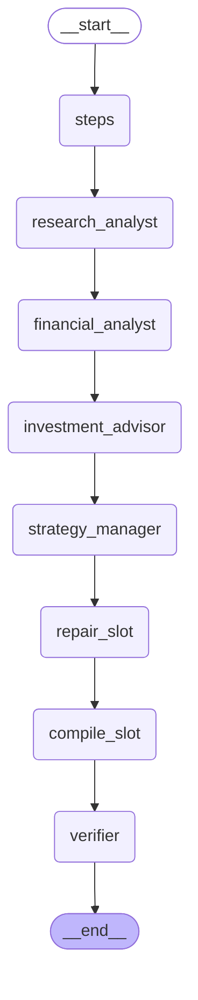

# Fixed workflow

Generated from the actual LangGraph definition; no model calls.

```mermaid
---
config:
  flowchart:
    curve: linear
---
graph TD;
	__start__([<p>__start__</p>]):::first
	steps(steps)
	research_analyst(research_analyst)
	financial_analyst(financial_analyst)
	investment_advisor(investment_advisor)
	strategy_manager(strategy_manager)
	repair_slot(repair_slot)
	compile_slot(compile_slot)
	verifier(verifier)
	__end__([<p>__end__</p>]):::last
	__start__ --> steps;
	compile_slot --> verifier;
	financial_analyst --> investment_advisor;
	investment_advisor --> strategy_manager;
	repair_slot --> compile_slot;
	research_analyst --> financial_analyst;
	steps --> research_analyst;
	strategy_manager --> repair_slot;
	verifier --> __end__;
	classDef default fill:#f2f0ff,line-height:1.2
	classDef first fill-opacity:0
	classDef last fill:#bfb6fc

```
